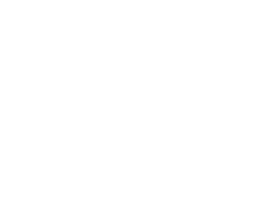

# 🏙️ MCH App Client ✨

<div align="center">
  
  <p><em>A powerful Next.js application for property management</em></p>
</div>

## 🚀 Getting Started

First, run the development server:

```bash
npm run dev # Runs on port 6969
# or
yarn dev
# or
pnpm dev
```

Open [http://localhost:6969](http://localhost:6969) with your browser to see the result.

## 📚 Project Overview

This application is built with:
- ⚛️ **React 18** - Frontend library
- 🔄 **Next.js 13** - React framework
- 🎨 **TailwindCSS** - Utility-first CSS framework
- 📊 **React Query** - Data fetching & state management
- 📅 **Date-fns** - Date manipulation library
- 📑 **jsPDF** - PDF generation
- 📊 **XLSX** - Excel file processing
- 🔄 **Axios** - HTTP client

## 🗂️ Complete Project Structure

```
📁 / (root)
├── 📄 Dockerfile
├── 📄 fly.toml
├── 📄 next.config.js
├── 📄 package.json
├── 📄 postcss.config.js
├── 📄 README.md
├── 📄 tailwind.config.js
├── 📄 tsconfig.json
├── 📁 @types/
│   └── 📄 alltypes.d.ts
├── 📁 public/
│   ├── 📄 favicon.ico
│   ├── 📄 next.svg
│   ├── 📄 thirteen.svg
│   ├── 📄 vercel.svg
│   ├── 📄 web_MCH-05.svg
│   └── 📁 img/
│       ├── 📁 bg/
│       │   ├── 📄 mBg.svg
│       │   ├── 📄 mBg100.svg
│       │   ├── 📄 mBg85.svg
│       │   ├── 📄 mBgOpac.svg
│       │   └── 📄 mBgOpac100.svg
│       └── 📁 ico/
│           ├── 📄 houseIco.svg
│           ├── 📄 icoArrow_old.svg
│           ├── 📄 icoArrow.svg
│           ├── 📄 LogoName.svg
│           ├── 📄 LogoS.png
│           ├── 📄 LogoWhite.svg
│           └── 📁 lang/
└── 📁 src/
    ├── 📁 client/
    │   ├── 📁 context/
    │   │   ├── 📄 UserContext.tsx
    │   │   └── 📄 UserState.tsx
    │   ├── 📁 helpers/
    │   │   ├── 📄 constants.ts
    │   │   ├── 📄 Filter.ts
    │   │   ├── 📄 IModel.ts
    │   │   ├── 📄 Path.ts
    │   │   ├── 📄 Util.ts
    │   │   ├── 📄 UtilCustom.ts
    │   │   └── 📄 Validations.ts
    │   ├── 📁 hooks/
    │   │   ├── 📁 ade/
    │   │   ├── 📁 atic/
    │   │   ├── 📁 ceo/
    │   │   ├── 📁 colaborador/
    │   │   ├── 📁 da/
    │   │   ├── 📁 dn/
    │   │   ├── 📁 dnmaster/
    │   │   ├── 📁 rmg/
    │   │   ├── 📁 rrhh/
    │   │   ├── 📁 rrhhmaster/
    │   │   └── 📁 share/
    │   ├── 📁 models/
    │   └── 📁 services/
    ├── 📁 components/
    │   ├── 📄 Layout.tsx
    │   ├── 📄 FloatButton.tsx
    │   ├── 📄 TableContainer.tsx
    │   ├── 📄 Modal.tsx
    │   ├── 📄 AlertContainer.tsx
    │   ├── 📄 ButtonContainerVertical.tsx
    │   ├── 📄 CardVarReservaContainer.tsx
    │   ├── 📄 ContentContainer.tsx
    │   ├── 📄 MenuLeftContainer.tsx
    │   ├── 📁 Iconos/
    │   ├── 📁 ade/
    │   ├── 📁 atic/
    │   ├── 📁 colaborador/
    │   ├── 📁 da/
    │   ├── 📁 dn/
    │   ├── 📁 pdf/
    │   ├── 📁 rmg/
    │   ├── 📁 rrhh/
    │   └── 📁 share/
    ├── 📁 pages/
    │   ├── 📄 _app.tsx
    │   ├── 📄 _document.tsx
    │   ├── 📄 404.tsx
    │   ├── 📄 index.tsx
    │   ├── 📄 login.tsx
    │   ├── 📁 ade/
    │   ├── 📁 admin/
    │   ├── 📁 atic/
    │   ├── 📁 ceo/
    │   ├── 📁 colaborador/
    │   ├── 📁 crm/
    │   ├── 📁 da/
    │   ├── 📁 dn/
    │   ├── 📁 dnmaster/
    │   ├── 📁 error/
    │   ├── 📁 profile/
    │   ├── 📁 propietario/
    │   ├── 📁 rmg/
    │   ├── 📁 rrhh/
    │   ├── 📁 rrhhmaster/
    │   └── 📁 superadmin/
    └── 📁 styles/
        ├── 📄 globals.css
        └── 📄 Home.module.css
```

## 🗂️ Key Architecture Concepts

```
├── 📁 src/
│   ├── 📁 client/       # Client-side logic
│   │   ├── 📁 context/  # Context API providers
│   │   ├── 📁 helpers/  # Utility functions
│   │   ├── 📁 hooks/    # Custom React hooks for data fetching
│   │   ├── 📁 models/   # TypeScript interfaces & data models
│   │   └── 📁 services/ # API services with Axios
│   ├── 📁 components/   # Reusable UI elements
│   │   └── 📁 Iconos/   # Icon components
│   ├── 📁 pages/        # Next.js pages & routing
│   └── 📁 styles/       # Global CSS & modules
```

## 💻 Key Features

- 🔐 **User Authentication** - Secure login system
- 🏙️ **Property Management** - Manage real estate properties
- 👥 **User Role Management** - Different access levels
- 📊 **Data Visualization** - Tables and visual representations
- 📱 **Responsive Design** - Works on desktop and mobile
- 🖨️ **PDF Generation** - Create reports and documents
- 📋 **Excel Integration** - Import/export data

## 🧩 Core Components

### 📱 UI Components
- **Layout** - Main layout wrapper with navigation
- **FloatButton** - Animated floating action buttons
- **TableContainer** - Customizable data tables
- **Modal** - Reusable modal component
- **CardVarReserva** - Property reservation cards

### 🧠 Logic Components
- **UserContext** - User authentication and permissions
- **Services** - API communication layers
- **Hooks** - Reusable business logic

## 📡 Data Fetching Architecture

The application uses a structured system to fetch data from the server:

### 📦 Service Layer
- **FetchApiService** - Main service for generic API requests
- **PisoService** - Property-specific operations
- **UserService** - User-related operations
- **LeadService** - Lead management operations

### 🔄 API Methods
```typescript
// Get all data
getAllData(path, handleError)

// Get filtered data
getAllWithFilter(path, dataFilter, handleError)

// Get single item
getSingleData(path, handleError)

// Create new item
create(path, data, handleError)

// Update existing item
update(path, data, handleError)

// Delete item
delete(path, handleError)
```

### 🪝 Custom Hooks
Each section uses dedicated hooks to manage state and API calls:
```typescript
// Property hooks
useApartment()
usePisoId()
usePisoShare()

// User hooks
useUser()
useVacacionesShare()

// Device hooks
useDevice()
```

## 🔧 Development Commands

```bash
# Development
npm run dev      # Start development server

# Production
npm run build    # Build for production
npm start        # Start production server

# Quality
npm run lint     # Run ESLint
```

## 🚀 Deployment

This project can be deployed using:

- 🌩️ **Vercel** - One-click deployment platform
- 🐳 **Docker** - Containerized deployment (Dockerfile included)
- ✈️ **Fly.io** - Cloud deployment (fly.toml included)

## 📝 Additional Notes

- This application uses Next.js API routes for backend functionality
- TailwindCSS is configured with custom theme settings
- Custom Google Fonts are optimized using next/font

---

<div align="center">
  <p>Built with ❤️ by the MCH Team</p>
  
  
  
</div>
